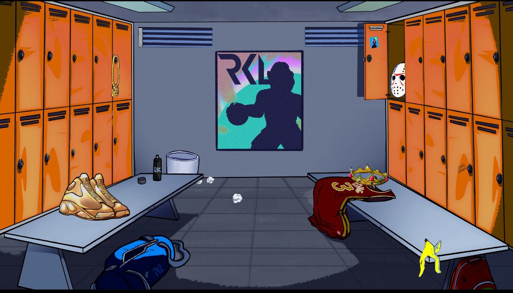

# NFT Marketplace



Contracts herein define a minimal general trustless marketplace for any ERC-721 or ERC-1155 implementation. They support:

- batch trading
- royalties
- withdraw pattern to avoid re-entrancy issues
- modular, you can decide if you would like to include royalties or not, for example
- events for optimal subgraph indexing
- (potentially) order editing

They are well-tested, a combination of stateful and unit tests.

You can use poetry for easy python virtual environment and requirements handling.

---

## Docker

Docker is a container technology used to provide an ephemeral (or temporary) environment to run code in - whether it is development or hosting a compiled artifact.

If you don't have Docker, please visit [https://www.docker.com](https://www.docker.com) to get started if you wish to use it for development.

### Poetry Shell

One of the images we have available is the `poetry.Dockerfile`, which is under the namespace `rumble-kong-league:v$VERSION-shell`.  This image is meant to be ran locally to assist in development efforts.  The easiest way to get going on this image, is to run the `make shell` command.

```sh
make shell
## or
export VERSION=$(cat pyproject.toml| grep version| awk -F'"' {'print $2'})
docker build -t rumble-kong-league/marketplace:v$VERSION-shell -f poetry.Dockerfile .
# next, run an instance of the built docker image
docker run -it --rm -v $(PWD):/marketplace rumble-kong-league/marketplace:v${VERSION}-shell
```

Once you build/run the given Docker environment, you should be in a ready-to-go Poetry environment to run all of your development tests.

----

LFG 👑🦍
